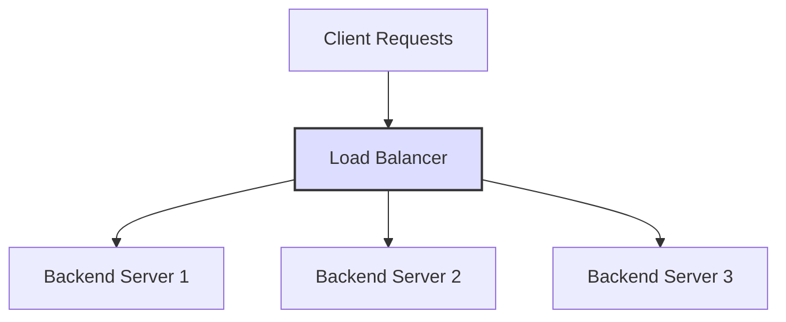

> With a side of Traefik.

## Load Balancers and Reverse Proxies

### Load Balancer

A load balancer distributes client requests evenly across multiple servers. It prevents traffic overload and improves availability and performance.



#### Purpose

- Distributing load
- High availability (failing over to another server when one goes down)

### Reverse Proxy

A reverse proxy sits between clients and backends. Instead of clients talking to a backend directly, the proxy receives the request, forwards it to the appropriate backend server, and returns the response.

#### Purpose

- Request routing (sending specific requests to specific servers based on URL or headers)
- TLS support
- Security (hiding backends from the outside)
- Extras such as caching, compression, and authentication filtering

### Comparison

| | Load Balancer | Reverse Proxy |
| --- | --- | --- |
| Main purpose | **Distribute** traffic across servers | **Relay** and **process** requests to the right server |
| Traffic distribution | Core feature | Secondary feature (can support it) |
| Extras | Focused on load balancing | Auth, caching, compression, TLS termination, URL-based routing, etc. |
| Examples | Traefik, HAProxy, AWS ALB | Traefik, Nginx, Apache, Envoy, etc. |

## Traefik and Nginx

### Traefik

A load balancer and reverse proxy written in Go.

It integrates with Let's Encrypt for automatic TLS and supports cloud-native service discovery.

As of June 2025 it has 55.2k GitHub stars.

[Traefik repository](https://github.com/traefik/traefik)

#### Automated service discovery

Traefik integrates with backends such as Kubernetes and Docker Swarm, detects service instances, and generates routing configuration. When a service is deployed, routing is updated automatically.

Nginx requires manual configuration.

#### Automatic HTTPS via Let's Encrypt

It issues and renews SSL certificates automatically, so serving over HTTPS is easy.

Nginx requires manual configuration.

#### Dashboard

A web UI shows routing, backends, and TLS status in real time.

#### Middleware

- Rate limiting
- BasicAuth
- Redirect, Rewrite, StripPrefix
- CORS configuration

### Nginx

The most commonly used reverse proxy. It receives requests and forwards them to the appropriate backend, and it also load balances via `upstream` blocks.

The open-source version only supports passive health checks based on `max_fails` and `fail_timeout`: when real requests fail, the server is temporarily taken out of rotation. Active health checks that probe backends periodically are exclusive to Nginx Plus (the commercial product).

### How Traefik and Nginx balance load

#### Traefik

- WRR (Weighted Round Robin): round robin that accounts for weights
- P2C (Power of Two Choices): pick two instances at random and choose the one with less load

#### Nginx

- RR (Round Robin)
- Least Connection
- IP Hash
- Generic Hash: routing based on a specific hash key
- Random: with the `two` option it behaves as P2C (1.15.1+)

Open-source Nginx only offers the passive approach: it watches for failed requests and temporarily excludes that server.

## Building a Load Balancer in Go

Let's build a load balancer in Go. We'll start with a simple round robin example, then build our own load balancer inspired by Traefik.

### A simple round robin load balancer

First, the simplest possible load balancer in Go.
The example below forwards requests to registered backend servers in turn, round robin style.

```go
package main

import (
	"log"
	"net/http"
	"net/http/httputil"
	"net/url"
	"sync/atomic"
)

var backends = []string{
	"http://localhost:8081",
	"http://localhost:8082",
	"http://localhost:8083",
}

var current uint64 // atomic counter

func getNextBackend() string {
	idx := atomic.AddUint64(&current, 1)
	return backends[int(idx)%len(backends)]
}

func handleProxy(w http.ResponseWriter, r *http.Request) {
	targetURL := getNextBackend()
	backendURL, err := url.Parse(targetURL)
	if err != nil {
		http.Error(w, "Bad backend URL", http.StatusInternalServerError)
		return
	}

	proxy := httputil.NewSingleHostReverseProxy(backendURL)
	proxy.ErrorHandler = func(w http.ResponseWriter, r *http.Request, e error) {
		http.Error(w, "Backend unavailable", http.StatusBadGateway)
	}
	proxy.ServeHTTP(w, r)
}

func main() {
	log.Println("Load balancer started on :8080")
	http.HandleFunc("/", handleProxy)
	log.Fatal(http.ListenAndServe(":8080", nil))
}
```

Let's refactor a bit.
Split Backend and LoadBalancer into separate structs.

First, the interface a backend must satisfy. `Name()` will be used later by the health check to identify a server.

```go
package backend

import "net/http"

// Backend is the interface a backend server must implement.
type Backend interface {
	ServeHTTP(w http.ResponseWriter, r *http.Request)
	Name() string
}
```

The round robin implementation lives in the `rr` package. Backend first.

```go
package rr

import (
	"net/http"
	"net/http/httputil"
	"net/url"

	"github.com/chaewonkong/loadigo/backend"
)

type Backend struct {
	http.Handler
	name string
}

// NewBackend creates a new backend server that acts as a reverse proxy to the specified server URL.
func NewBackend(serverURL string) (backend.Backend, error) {
	u, err := url.Parse(serverURL)
	if err != nil {
		return nil, err
	}

	return &Backend{
		Handler: httputil.NewSingleHostReverseProxy(u),
		name:    serverURL,
	}, nil
}

func (b *Backend) ServeHTTP(w http.ResponseWriter, r *http.Request) {
	b.Handler.ServeHTTP(w, r)
}

func (b *Backend) Name() string {
	return b.name
}
```

Next, the load balancer.

```go
package rr

import (
	"fmt"
	"net/http"
	"sync/atomic"

	"github.com/chaewonkong/loadigo/backend"
)

type LoadBalancer interface {
	ServeHTTP(w http.ResponseWriter, r *http.Request)
	AddServer(svr backend.Backend) error
}

type loadBalancer struct {
	servers []backend.Backend
	current uint64
}

// NewLoadBalancer creates a new LoadBalancer instance.
func NewLoadBalancer() LoadBalancer {
	return &loadBalancer{
		servers: make([]backend.Backend, 0),
	}
}

// nextServer picks the next backend in round-robin order.
func (lb *loadBalancer) nextServer() http.Handler {
	if len(lb.servers) == 0 {
		return nil
	}
	idx := atomic.AddUint64(&lb.current, 1)
	return lb.servers[int(idx)%len(lb.servers)]
}

func (lb *loadBalancer) ServeHTTP(w http.ResponseWriter, r *http.Request) {
	svr := lb.nextServer()
	if svr == nil {
		http.Error(w, "No backend available", http.StatusServiceUnavailable)
		return
	}

	svr.ServeHTTP(w, r)
}

func (lb *loadBalancer) AddServer(svr backend.Backend) error {
	if svr == nil {
		return fmt.Errorf("server cannot be nil")
	}
	lb.servers = append(lb.servers, svr)

	return nil
}
```

Finally, main.

```go
package main

import (
	"log"
	"net/http"

	"github.com/chaewonkong/loadigo/backend/rr"
)

var backends = []string{
	"http://localhost:8081",
	"http://localhost:8082",
	"http://localhost:8083",
}

func main() {
	balancer := rr.NewLoadBalancer()

	// register each server in the list
	for _, u := range backends {
		b, err := rr.NewBackend(u)
		if err != nil {
			log.Fatalf("Failed to create backend for %s: %v", u, err)
		}
		err = balancer.AddServer(b)
		if err != nil {
			log.Fatalf("Failed to add backend %s: %v", u, err)
		}
	}

	if err := http.ListenAndServe(":8080", balancer); err != nil {
		log.Fatalf("Failed to start server: %v", err)
	}
}
```

The LoadBalancer keeps track of the server offset and picks the next server on every request.

### Health Check

Now let's improve the load balancer so it checks the status of registered servers. A server that fails its health check is dropped from the healthy set so it no longer receives requests, and put back once it recovers.

```go
// Package rr implements a round-robin load balancer.
package rr

import (
	"fmt"
	"log"
	"net/http"
	"slices"
	"sync"
	"sync/atomic"
	"time"

	"github.com/chaewonkong/loadigo/backend"
)

// LoadBalancer defines the interface for a load balancer that can distribute requests
type LoadBalancer interface {
	ServeHTTP(w http.ResponseWriter, r *http.Request)
	AddServer(svr backend.Backend) error
	CheckServerStatus()
}

type loadBalancer struct {
	servers []backend.Backend
	status  map[string]struct{}
	current uint64
	ticker  *time.Ticker
	mu      sync.RWMutex
}

var healthClient = &http.Client{Timeout: 2 * time.Second}

// NewLoadBalancer creates a new LoadBalancer instance.
func NewLoadBalancer(ticker *time.Ticker) LoadBalancer {
	return &loadBalancer{
		servers: make([]backend.Backend, 0),
		status:  make(map[string]struct{}),
		ticker:  ticker,
	}
}

func (lb *loadBalancer) nextServer() http.Handler {
	lb.mu.RLock()
	defer lb.mu.RUnlock()

	if len(lb.servers) == 0 {
		return nil
	}

	for range len(lb.servers) {
		idx := atomic.AddUint64(&lb.current, 1)
		svr := lb.servers[int(idx)%len(lb.servers)]
		if _, ok := lb.status[svr.Name()]; ok {
			return svr
		}
	}

	return nil
}

func (lb *loadBalancer) ServeHTTP(w http.ResponseWriter, r *http.Request) {
	svr := lb.nextServer()
	if svr == nil {
		http.Error(w, "No backend available", http.StatusServiceUnavailable)
		return
	}

	svr.ServeHTTP(w, r)
}

func (lb *loadBalancer) AddServer(svr backend.Backend) error {
	if svr == nil {
		return fmt.Errorf("server cannot be nil")
	}

	lb.mu.Lock()
	defer lb.mu.Unlock()

	lb.servers = append(lb.servers, svr)
	lb.status[svr.Name()] = struct{}{}
	return nil
}

func (lb *loadBalancer) CheckServerStatus() {
	for range lb.ticker.C {
		lb.mu.RLock()
		servers := slices.Clone(lb.servers)
		lb.mu.RUnlock()

		for _, svr := range servers {
			name := svr.Name()
			alive := lb.checkServerStatus(name)

			lb.mu.Lock()
			if alive {
				lb.status[name] = struct{}{}
			} else {
				delete(lb.status, name)
				log.Printf("Server %s is down, removing from status", name)
			}
			lb.mu.Unlock()
		}
	}
}

func (lb *loadBalancer) checkServerStatus(url string) bool {
	resp, err := healthClient.Get(url)
	if err != nil {
		return false
	}
	defer resp.Body.Close()

	return resp.StatusCode == http.StatusOK
}
```

`status` is the set of currently healthy server names. `nextServer()` walks round robin and returns only servers present in `status`; if a full lap finds none, it returns nil.

`CheckServerStatus()` walks all of `servers` on every tick and updates `status`. Iterating over `status` instead would mean a server that drops out is never checked again and can never come back, so the walk has to be over `servers`. Because `AddServer` can run concurrently, the slice is cloned under the lock and checked outside it.

Health check requests go through a dedicated client with a timeout. Plain `http.Get` has none, so a single hung server could stall the whole check loop.

main.go gains a goroutine.

```go
func main() {
	ticker := time.NewTicker(5 * time.Second)
	balancer := rr.NewLoadBalancer(ticker)
	for _, u := range backends {
		b, err := rr.NewBackend(u)
		if err != nil {
			log.Fatalf("Failed to create backend for %s: %v", u, err)
		}
		err = balancer.AddServer(b)
		if err != nil {
			log.Fatalf("Failed to add backend %s: %v", u, err)
		}
	}

	go balancer.CheckServerStatus() // this line is new

	if err := http.ListenAndServe(":8080", balancer); err != nil {
		log.Fatalf("Failed to start server: %v", err)
	}
}
```

### Weighted Round Robin

A variant of round robin where each server has a weight, and servers with higher weights receive proportionally more requests.

It is Traefik's default strategy.

Traefik's Weighted Round Robin is based on EDF (Earliest Deadline First). The server whose deadline is closest handles the request, and deadlines are computed and stored with the weight taken into account.

1. Each server is registered with a deadline. On registration, the deadline is set to the load balancer's current deadline plus `1/weight`.
2. For every request, the load balancer picks the server with the nearest deadline and delegates to it.
3. The chosen server gets a new deadline of its old deadline plus `1/weight` and rejoins the next round.

Here curDeadline is a virtual clock representing how far the schedule has progressed. (The scheduling reference point.)

#### backend

weight and deadline are added. deadline is used internally when picking the next server, and weight is a per-server value greater than 0. It is validated at construction so `1/weight` can never divide by zero.

```go
type Backend struct {
	http.Handler
	name string

	weight   float64
	deadline float64
}

// NewBackend creates a new backend server that acts as a reverse proxy to the specified server URL.
func NewBackend(serverURL string, weight float64) (backend.Backend, error) {
	u, err := url.Parse(serverURL)
	if err != nil {
		return nil, err
	}

	if weight <= 0 {
		return nil, fmt.Errorf("weight must be greater than 0, got %f", weight)
	}

	return &Backend{
		Handler: httputil.NewSingleHostReverseProxy(u),
		name:    serverURL,
		weight:  weight,
	}, nil
}
```

#### lb

We make it a min heap so that backends with the smallest deadline come out first.

```go
type loadBalancer struct {
	servers []*Backend
	status  map[string]struct{}
	ticker  *time.Ticker
	mu      sync.RWMutex

	// curDeadline is the deadline of the most recently selected backend.
	// Newly added backends start from it so they cannot monopolize selection.
	curDeadline float64
}

// heap.Interface implementation for loadBalancer

func (lb *loadBalancer) Len() int {
	return len(lb.servers)
}

func (lb *loadBalancer) Less(i, j int) bool {
	return lb.servers[i].deadline < lb.servers[j].deadline
}

func (lb *loadBalancer) Swap(i, j int) {
	lb.servers[i], lb.servers[j] = lb.servers[j], lb.servers[i]
}

func (lb *loadBalancer) Push(x any) {
	b, ok := x.(*Backend)
	if !ok {
		return
	}

	lb.servers = append(lb.servers, b)
}

func (lb *loadBalancer) Pop() any {
	if len(lb.servers) == 0 {
		return nil
	}

	b := lb.servers[len(lb.servers)-1]
	lb.servers = lb.servers[:len(lb.servers)-1]

	return b
}
```

Next, AddServer, which adds a backend to the lb.

```go
func (lb *loadBalancer) AddServer(svr backend.Backend) error {
	if svr == nil {
		return fmt.Errorf("server cannot be nil")
	}

	b, ok := svr.(*Backend)
	if !ok {
		return fmt.Errorf("server must be of type *wrr.Backend")
	}

	lb.mu.Lock()
	defer lb.mu.Unlock()

	// set initial deadline for the server
	b.deadline = lb.curDeadline + 1/b.weight
	heap.Push(lb, b)

	lb.status[b.Name()] = struct{}{}
	return nil
}
```

It adds `1/backend.weight` to the lb's curDeadline.

`heap.Push` calls `lb.Push` internally, which already appends to `lb.servers`, so there is no separate append. Appending twice would put the same backend in the heap twice, with the second copy sitting at the end of the slice without going through the heap invariant.

curDeadline holds the deadline of the server the lb routed to most recently. Computing a new server's deadline from it means a newly added server is not automatically chosen first, but chosen according to its weight.

If curDeadline is 0:
a weight of 0.5 gives a deadline of 2,
a weight of 0.25 gives a deadline of 4.

Since a min heap pops the smallest value first, servers with larger weights end up being chosen first.

Finally, `nextServer()` looks like this.

```go
func (lb *loadBalancer) nextServer() http.Handler {
	lb.mu.Lock()
	defer lb.mu.Unlock()

	if len(lb.status) == 0 {
		return nil
	}

	var b *Backend
	for {
		b = heap.Pop(lb).(*Backend)

		lb.curDeadline = b.deadline
		b.deadline += 1 / b.weight
		heap.Push(lb, b)

		if _, ok := lb.status[b.Name()]; ok {
			break
		}
	}

	return b
}
```

Among healthy servers, the one with the smallest deadline is returned.

If no server is healthy it returns nil up front. Without that guard the loop below would Pop and Push forever. Traefik's WRR checks for an empty healthy set first for the same reason.

On every loop iteration, the lb's curDeadline is set to `backend.deadline`, and `1/backend.weight` is added to the backend's deadline.

curDeadline is overwritten with the deadline of the backend popped from the heap so that servers added later get their deadlines computed relative to the most recently chosen server.

In other words, curDeadline exists so that newly added servers compete fairly.

#### Summary

With three servers weighted 0.2, 0.3, and 0.5 and 1000 incoming requests, the distribution looks roughly like this.

| Server | Requests (expected) |
| --- | --- |
| A | 200 |
| B | 300 |
| C | 500 |

### P2C

feat. Traefik

#### P2C (Power of Two Choices)

Pick two servers at random, then route to whichever of the two has fewer in-flight connections.

It is simple to implement yet effective, and Traefik offers it too.

| Strategy | Max load imbalance | n = 1000 |
| --- | --- | --- |
| Random choice | `O(log n / log log n)` | 3.58 |
| **P2C** | `O(log log n)` | 2.79 |

With purely random distribution, a single server can end up handling close to 3.6 times more requests than average. P2C keeps it far lower, and the gap widens as n grows.

#### backend

Add an inflight counter so we can see how many requests a backend is currently handling.

```go
type Backend struct {
	http.Handler
	name string

	// inflight tracks the number of inflight requests to this backend.
	inflight atomic.Int64
}

func (b *Backend) ServeHTTP(w http.ResponseWriter, r *http.Request) {
	// Increment the inflight counter when a request is received.
	// Decrement it when the request is done.
	b.inflight.Add(1)
	defer b.inflight.Add(-1)

	b.Handler.ServeHTTP(w, r)
}

func (b *Backend) Inflight() int64 {
	return b.inflight.Load()
}
```

#### lb

Now the load balancer logic.

```go
type loadBalancer struct {
	servers []*Backend
	status  map[string]struct{}
	ticker  *time.Ticker
	mu      sync.RWMutex

	randInt func(n int) int
}

// NewLoadBalancer creates a new LoadBalancer instance.
func NewLoadBalancer(ticker *time.Ticker) LoadBalancer {
	return &loadBalancer{
		servers: make([]*Backend, 0),
		status:  make(map[string]struct{}),
		ticker:  ticker,
		randInt: rand.IntN,
	}
}
```

We will pick two servers at random and route to the one with fewer in-flight requests, so a randInt function is added. It is a function field so tests can swap in a deterministic one.

`rand.IntN` from `math/rand/v2` returns a random int between 0 and n-1 and is safe for concurrent use, so no extra mutex is needed.

Now `nextServer()`.

First filter down to healthy servers, then pick random ints i and j.
If `i == j`, add 1 to j and take it modulo the number of healthy servers.

```go
func (lb *loadBalancer) nextServer() http.Handler {
	healthy := []*Backend{}
	lb.mu.RLock()
	for _, b := range lb.servers {
		if _, ok := lb.status[b.Name()]; ok {
			healthy = append(healthy, b)
		}
	}
	lb.mu.RUnlock()
	if len(healthy) == 0 {
		return nil
	}

	if len(healthy) == 1 {
		return healthy[0]
	}

	// p2c
	// randInt returns a random integer between 0 and n-1
	i, j := lb.randInt(len(healthy)), lb.randInt(len(healthy))

	// Ensure i and j are different
	if i == j {
		j = (j + 1) % len(healthy)
	}

	b1, b2 := healthy[i], healthy[j]

	// check load (inflight requests) and return backend with fewer inflight requests
	if b1.Inflight() < b2.Inflight() {
		return b1
	}

	return b2
}
```

Finally, return the backend with fewer in-flight requests and we're done.

Here is AddServer. Not much has changed, except a convenience check that the value is a `*Backend`.
(A future refactor should probably remove the type assertion.)

```go
func (lb *loadBalancer) AddServer(svr backend.Backend) error {
	if svr == nil {
		return fmt.Errorf("server cannot be nil")
	}

	b, ok := svr.(*Backend)
	if !ok {
		return fmt.Errorf("server must be of type *p2c.Backend")
	}

	lb.mu.Lock()
	defer lb.mu.Unlock()

	lb.servers = append(lb.servers, b)
	lb.status[b.Name()] = struct{}{}
	return nil
}
```

## Room for Improvement

Traefik supports service discovery in cloud-native environments. It detects Pods, Services, and Endpoints and generates routes automatically.

When infrastructure changes often because of autoscaling or rolling updates, it is hard for a person to keep routing configuration up to date by hand.

Traefik picks up changed IPs and ports automatically, which makes it a great fit for Kubernetes.

Our load balancer has no service discovery, so backend IPs and ports have to be configured manually.

Traefik talks to the Kubernetes API server and watches resources in real time. That would be a good next thing to add.

## References

- [Repo with the code above](https://github.com/chaewonkong/loadigo)
- [Creating a Load Balancer in GO](https://medium.com/@leonardo5621_66451/building-a-load-balancer-in-go-1c68131dc0ef)
- [Golang Load Balancer](https://github.com/leonardo5621/golang-load-balancer)
- [Traefik Docs](https://doc.traefik.io/traefik/)
- [Traefik P2C implementation](https://github.com/traefik/traefik/blob/master/pkg/server/service/loadbalancer/p2c/p2c.go)
